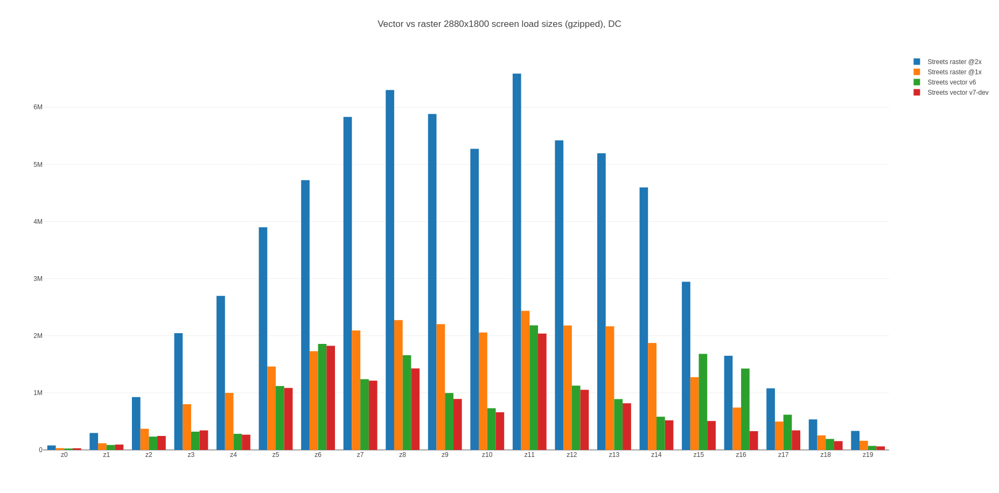
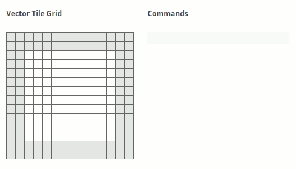
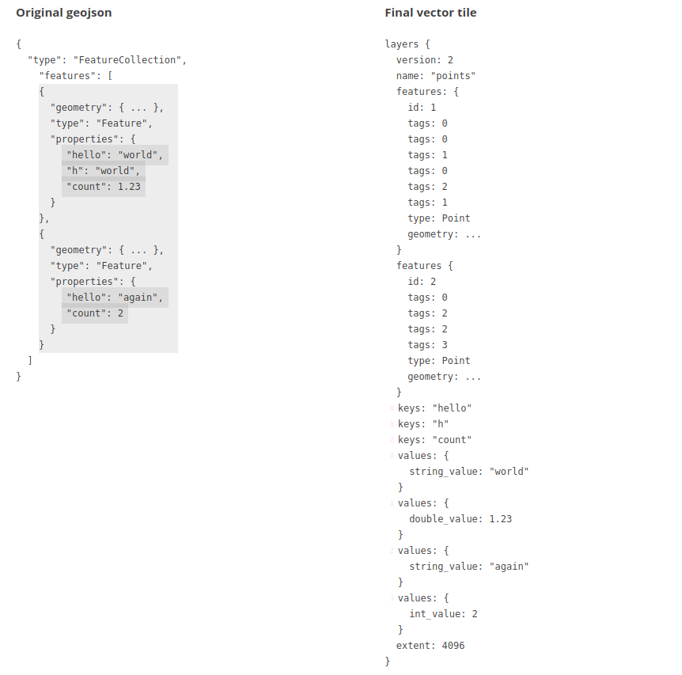
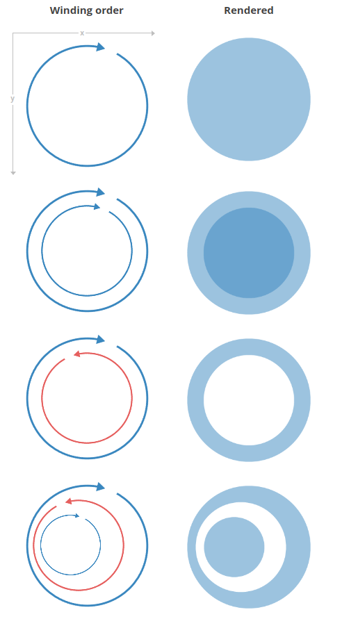
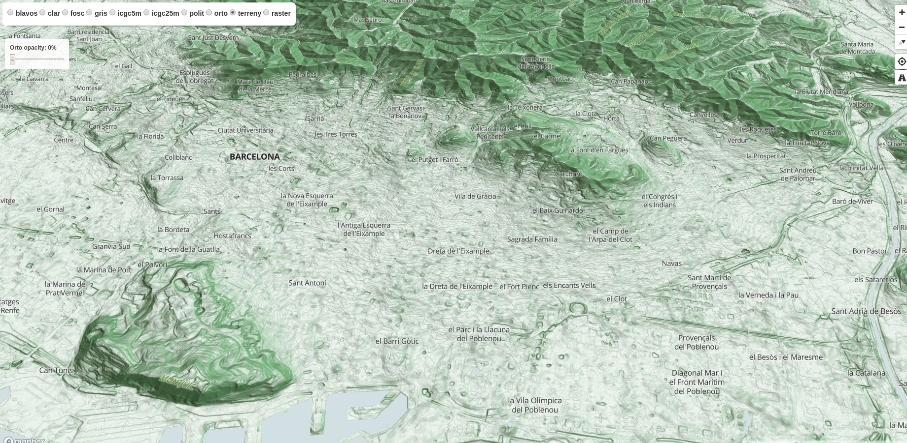
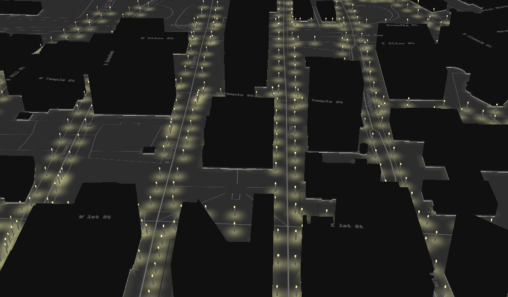
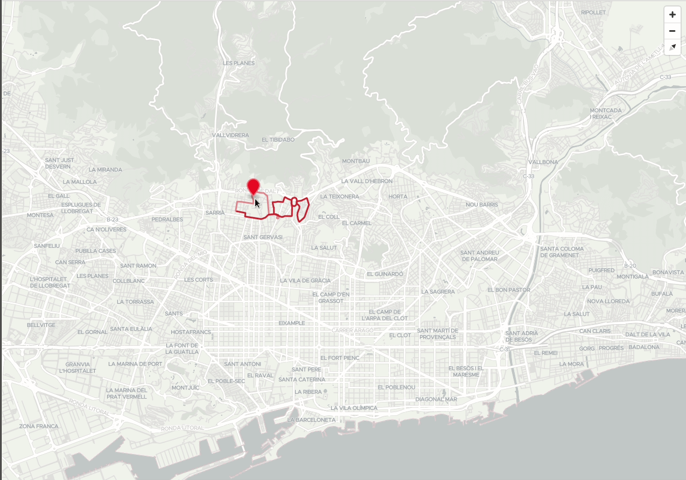
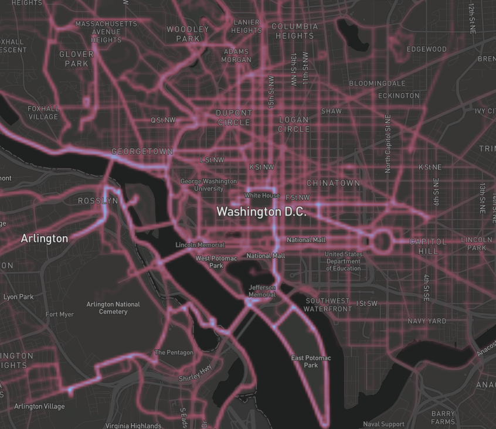

# Qué son las teselas vectoriales

!!! tip "Presentación"
    Ver este capítulo en [formato presentación](../presentacion/)

Las teselas vectoriales son un formato de datos liviano para almacenar datos vectoriales geoespaciales, como puntos, líneas y polígonos. Las teselas vectoriales codifican información geográfica de acuerdo con la especificación de teselas vector de Mapbox. La especificación de Mapbox es un estándar abierto bajo una licencia Creative Commons Attribution 3.0 US.

Una tesela vectorial (vector tiles) contiene datos vectoriales georreferenciados (puede contener múltiples capas), recortados en teselas para facilitar su recuperación. Son equivalentes a las teselas raster tradicionales (WMTS, TMS) pero retornan datos vectoriales en lugar de una imagen.

Cada conjunto de teselas vectoriales tiene su propio esquema. Un esquema consiste en nombres de capas, atributos, selección de elementos, etc.

No existe un esquema que sirva para todo. Existen varios esquemas como por ejemplo: OpenMapTiles, Mapbox Streets, etc.

!!! warning
    Las teselas vectoriales no son un formato de datos vectoriales estilo Shapefile, GeoJSON, etc. pensado para trabajar (hacer análisis, explotación de datos, etc.) sino que está pensado y enfocado principalmente en la visualización.

## Diferencias entre teselas raster y teselas vectoriales

| Teselas vectoriales | Teselas raster |
|---|---|
|Estilo se define en el cliente|Estilo se define en el servidor|
|Sólo se necesita teselar la información una sola vez y se pueden tener múltiples mapas|Hay que teselas la información para cada mapa|
|*Overzoom* se mantiene resolución|*Overzoom* pierde resolución (pixelado)|
|Menor tamaño (se recomienda máximo 500kb)|Más fáciles de consumir|
|Cache ocupa mucho menos espacio. Fáctible el uso en dispositivos móviles sin conexión|Cache ocupa mucho espacio. Uso en dispositivos móviles requiere mucho espacio de disco|
|Acceso nativo a la información del objeto (atributos y geometría), lo que permite un procesamiento muy sofisticado||
|Se ven mejor en dispositivos de alta resolución||

Comparativa pesos teselas vector vs raster. Fuente https://plot.ly/~mourner/118.embed

## Cómo están hechas por dentro

Las geometrías y los atributos se codifican como datos binarios de Google Protobuf (PBF).

### Codificar geometrías

Para codificar información geográfica en una tesela vectorial, una herramienta debe convertir las coordenadas geográficas, como la latitud y la longitud, en coordenadas vectoriales de cuadrículas. Las teselas de vectoriales no tienen ningún concepto de información geográfica. Codifican puntos, líneas y polígonos como pares x/y relativos a la esquina superior izquierda de la cuadrícula de forma descendente.

Las geometrías son transformadas a una sola tesela, con un sistema de coordenadas de píxel local, que por defecto va de la esquina superior izquierda (0,0) a la esquina inferior derecha (4096,4096).

Codificar geometría. Fuente https://www.mapbox.com/vector-tiles/specification/#encoding-geom

### Codificar atributos

Los atributos se codifican como un conjunto único de claves (algo así como un esquema de campos de capa) y la lista de sus valores.

Los atributos están codificados en una serie de etiquetas que existen dentro de un elemento en el vector que tienen valores enteros que hacen referencia a las claves y los valores que provienen de la geometría. Esto elimina la redundancia de los atributos para geometrías que tienen las mismas claves y valores similares.

Codificar atributos. Fuente https://www.mapbox.com/vector-tiles/specification/#encoding-attr

### Winding order

El *Winding order* (dirección de digitalización) se refiere a la dirección en que se dibuja un anillo en un mosaico vectorial, ya sea en sentido horario o antihorario. Muchas geometrías son multipolígonos con "agujeros", que también se representan como anillos de polígono. Es importante poder inferir el orden al extraer datos fuente de un mosaico vectorial y comprender si la geometría es parte de un polígono múltiple o un polígono único.

Para que los procesadores distingan de manera apropiada que polígonos son agujeros y cuáles son geometrías únicas, la especificación requiere que todos los polígonos sean válidos (validez de OGC). Cualquier anillo interior poligonal debe orientarse con el orden opuesto al de su anillo exterior principal y todos los anillos interiores deben seguir directamente el anillo exterior al que pertenecen. Los anillos exteriores deben estar orientados en el sentido de las agujas del reloj y los anillos interiores deben estar orientados en sentido contrario a las agujas del reloj.

Winding order. Fuente https://www.mapbox.com/vector-tiles/specification/#winding-order

## Presentación de ejemplos visuales hechos con vt

### Terreno

https://openicgc.github.io/

### Luces LA

### Edificios con música

https://codepen.io/jwhazel/pen/NYzpWG

blog explicativo https://medium.com/@erdag/mappox-mapmadness18-round-4-1251a8c10421

### Temático filtro

### Filtrado al vuelo

### Mapa de calor

