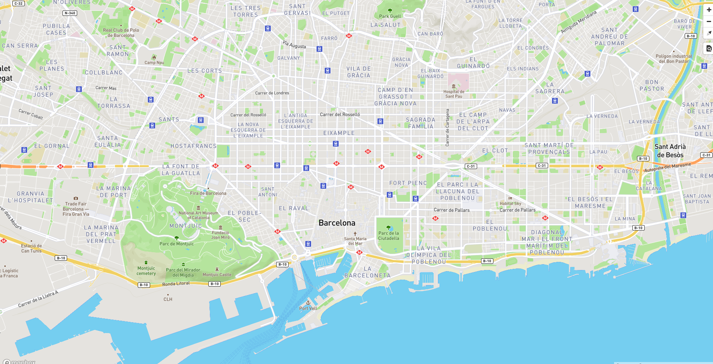
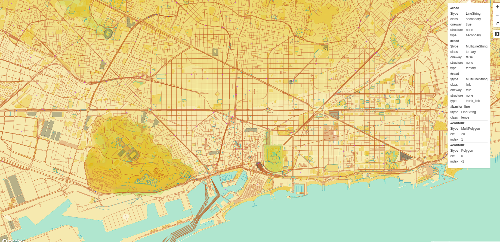

# Mi primer mapa

## Hola Mapa

Vamos a crear un fichero `barcelona.html`.

```html
<!DOCTYPE html>
<html>
<head>
    <meta charset="UTF-8">
    <meta name="viewport" content="width=device-width, initial-scale=1">
    <title>Mapa VT</title>
    <script src='https://api.tiles.mapbox.com/mapbox-gl-js/v0.49.0/mapbox-gl.js'></script>
    <link href='https://api.tiles.mapbox.com/mapbox-gl-js/v0.49.0/mapbox-gl.css' rel='stylesheet' />
    <style>
        html, body {
            margin: 0;
            height: 100%;
        }
    </style>
</head>
<body id='map'>
<script>
    mapboxgl.accessToken = 'pk.eyJ1IjoiYm9sb2xsbyIsImEiOiI3MDlqRnJJIn0.m-zCTI_UaEOCiCakGUDwcw';
    var map = new mapboxgl.Map({
        container: 'map', // id del elemento HTML que contendrá el mapa
        style: 'mapbox://styles/mapbox/streets-v9', // Ubicación del estilo
        center: [2.175, 41.39], // Ubicación inicial
        zoom: 13, // Zoom inicial
        bearing: -45, // Ángulo de rotación inicial
        hash: true // Permite ir guardando la posición del mapa en la URL
    });

    // Agrega controles de navegación (zoom, rotación) al mapa:
    map.addControl(new mapboxgl.NavigationControl());
</script>
</body>
</html>
```


Resultado visor simple

## Inspector de datos

El control [mapbox-gl-inspect](https://github.com/lukasmartinelli/mapbox-gl-inspect) permite ver todos los elementos
de un VT, así como pasar el cursor sobre los elementos para ver sus propiedades.

Agregar el código de la librería, e instanciar el control tras crear el mapa:

```html hl_lines="9 10 32 33"
<!DOCTYPE html>
<html>
<head>
    <meta charset="UTF-8">
    <meta name="viewport" content="width=device-width, initial-scale=1">
    <title>Mapa VT</title>
    <script src='https://api.tiles.mapbox.com/mapbox-gl-js/v0.49.0/mapbox-gl.js'></script>
    <link href='https://api.tiles.mapbox.com/mapbox-gl-js/v0.49.0/mapbox-gl.css' rel='stylesheet' />
    <link href='https://mapbox-gl-inspect.lukasmartinelli.ch/dist/mapbox-gl-inspect.css' rel='stylesheet' />
    <script src='https://mapbox-gl-inspect.lukasmartinelli.ch/dist/mapbox-gl-inspect.min.js'></script>
    <style>
        html, body {
            margin: 0;
            height: 100%;
        }
    </style>
</head>
<body id='map'>
<script>
    mapboxgl.accessToken = 'pk.eyJ1IjoiYm9sb2xsbyIsImEiOiI3MDlqRnJJIn0.m-zCTI_UaEOCiCakGUDwcw';
    var map = new mapboxgl.Map({
        container: 'map', // id del elemento HTML que contendrá el mapa
        style: 'mapbox://styles/mapbox/streets-v9', // Ubicación del estilo
        center: [2.175, 41.39], // Ubicación inicial
        zoom: 13, // Zoom inicial
        bearing: -45, // Ángulo de rotación inicial
        hash: true // Permite ir guardando la posición del mapa en la URL
    });
    // Agrega controles de navegación (zoom, rotación) al mapa:
    map.addControl(new mapboxgl.NavigationControl());
    // Agregar el control de inspección
    map.addControl(new MapboxInspect());
</script>
</body>
</html>
```

Recargar la página en el navegador y veremos que nos aparece un nuevo botón en el lado derecho superior de la pantalla, el cual permite la "visión de rayos X" sobre los datos.


Inspect

## Contenido de un fichero de estilo

Como vemos en el código, el visor es muy sencillo y parece que toda la "magia" se esconde en el fichero de estilo tras la URL `mapbox://styles/mapbox/streets-v9`. La API de Mapbox GL JS transforma  esta URL en `https://api.mapbox.com/styles/v1/mapbox/streets-v9?access_token=pk.eyJ1IjoiYm9sb2xsbyIsImEiOiI3MDlqRnJJIn0.m-zCTI_UaEOCiCakGUDwcw` que es la URL real del estilo.

Si abrimos la URL vemos que es un objeto JSON bastante complejo, pero si nos fijamos en las propiedades de primer nivel son pocas.
Las principales son:

```json
{
  "version": 8,
  "name": "Mapbox Streets",
  "sprite": "mapbox://sprites/mapbox/streets-v9",
  "glyphs": "mapbox://fonts/mapbox/{fontstack}/{range}.pbf",
  "sources": {...},
  "layers": [...]
}
```

* `version` el número de versión siempre es 8, es obligatoria.
* `name` es una etiqueta para mostrar el nombre del estilo, es opcional pero conveniente.
* `sprite` indica donde obtener el conjunto de **iconos** necesarios para simbolizar.
* `glyphs`: indica donde obtener el conjunto de **tipografías** necesarios para simbolizar.
* `sources`: objeto que define los orígenes de los datos.
* `layers`: matriz que contiene las reglas de simbolización. El orden dentro de la matriz es importante ya que la forma en que se van dibujando, hace que la primera regla quede por debajo del todo y la última regla quede por encima del todo. De esta manera, la primera regla suele ser el color de fondo del mapa, y las últimas suelen
ser la toponimia o los PoIs.

Habitualmente también se usan otras propiedades para indicar la vista inicial del mapa. Por ejemplo:

```json
{
  ...
  "center": [2.15, 41.39],
  "zoom": 12,
  "bearing": -45,
  "pitch": 0
}
```

* `center` son las coordenadas iniciales donde centrar el mapa [lon, lat]
* `zoom` es el zoom inicial del mapa
* `bearing` es la rotación inicial del mapa (en grados)
* `pitch` es la inclinación inicial del mapa para verlo en perspectiva (de 0 a 60 grados)

!!! tip
    La especificación completa del fichero de estilo es parte de la [documentación on-line de Mapbox GL
    JS](https://www.mapbox.com/mapbox-gl-js/style-spec/).

!!! tip
    Si quisiéramos editar el fichero de estilo, basta con guardarnos una copia local junto a `barcelona.html` y
    modificar la propiedad `style` para apuntar a una URL relativa.
