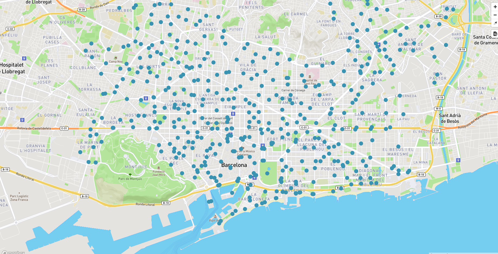

# Cómo servirlas (mapbox online)

## Crear cuenta en Mapbox

Visitar la página <https://www.mapbox.com/signup/> y crear una cuenta gratuita.

## Subir GeoJSON a Mapbox

Hacer login en la cuenta de Mapbox y seleccionar primero la opción de **Studio** y luego la pestaña de **Datasets** ó también se puede ir directamente desde <https://www.mapbox.com/studio/datasets/>.

En el apartado de Datasets es donde se pueden subir los datos o crear un conjunto de datos desde cero.

Para subir un cojunto de datos presionar el botón de **New dataset**. Seleccionar la pestaña de **Upload** en la ventana que se despliega y arrastrar o seleccionar el archivo que se desea subir.

Los formatos de archivos soportados son: GeoJSON, JSON y CSV.

En la carpeta *downloads* encontrar algunos archivos en formato GeoJSON. Subir los archivos *08019_carril_bici*, *08019_punts_ancoratge_bicicletes* y *08019_stations*. Al subir los archivos renombrarlos a *carril_bici*, *punts_ancoratge_bicicletes* y *stations* respectivamente.

Para poder dar estilo y utilizar los datos primero hay que convertilos en un **Tileset**. Para ello presionar el botón de **Menu** y seleccionar la opción de **Export to tileset**. En la ventana que se despliega seleccionar la opción de *Export to a new tileset* y presionar el botón de **Export**.

## Visualizar los datos en el visor

Modificar el archivo barcelona.html para que contenga el siguiente código:

```html hl_lines="35 36 37 38 39 40 41 42 43 44 45 46 47 48 49 50 51 52 53 54"
<!DOCTYPE html>
<html>
<head>
    <meta charset="UTF-8">
    <meta name="viewport" content="width=device-width, initial-scale=1">
    <title>Mapa VT</title>
    <script src='https://api.tiles.mapbox.com/mapbox-gl-js/v0.49.0/mapbox-gl.js'></script>
    <link href='https://api.tiles.mapbox.com/mapbox-gl-js/v0.49.0/mapbox-gl.css' rel='stylesheet' />
    <link href='https://mapbox-gl-inspect.lukasmartinelli.ch/dist/mapbox-gl-inspect.css' rel='stylesheet' />
    <script src='https://mapbox-gl-inspect.lukasmartinelli.ch/dist/mapbox-gl-inspect.min.js'></script>
    <style>
        html, body {
            margin: 0;
            height: 100%;
        }
    </style>
</head>
<body id='map'>
<script>
    mapboxgl.accessToken = 'pk.eyJ1IjoiYm9sb2xsbyIsImEiOiI3MDlqRnJJIn0.m-zCTI_UaEOCiCakGUDwcw';
    var map = new mapboxgl.Map({
        container: 'map', // id del elemento HTML que contendrá el mapa
        style: 'mapbox://styles/mapbox/streets-v9', // Ubicación del estilo
        center: [2.175, 41.39], // Ubicación inicial
        zoom: 13, // Zoom inicial
        bearing: -45, // Ángulo de rotación inicial
        hash: true // Permite ir guardando la posición del mapa en la URL
    });

    // Agrega controles de navegación (zoom, rotación) al mapa:
    map.addControl(new mapboxgl.NavigationControl());
    // Agregar el control de inspección
    map.addControl(new MapboxInspect());

    map.on('load', function () {
        map.addSource('stations', {
            type: 'vector',
            url: 'MAP ID DEL TILESET'
        });

        map.addLayer({
            'id': 'stations',
            'type': 'circle',
            'source': 'stations',
            'layout': {
                'visibility': 'visible'
            },
            'paint': {
                'circle-radius': 8,
                'circle-color': 'rgba(55,148,179,1)'
            },
            'source-layer': 'stations'
        });
    });

</script>
</body>
</html>
```

Para obtener el Map ID del tileset seleccionar la pestaña **Tilesets** y presionar el botón *Menu* de la capa de stations. Copiar el **Map ID**.

Remplazar donde dice *MAP ID DEL TILESET* por el id copiado. Ejemplo de identificador *mapbox://bolollo.cjmtjlsp30e2232lk64u3a3zm-5dzl6*

Recargar la página del mapa para ver los puntos de las estaciones de Bicing en el mapa.


Resultado visor con estaciones de Bicing