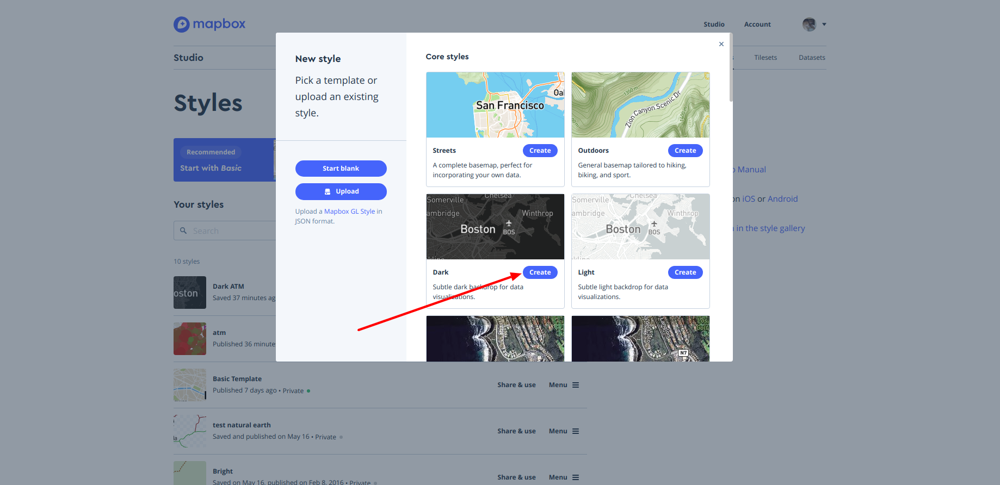
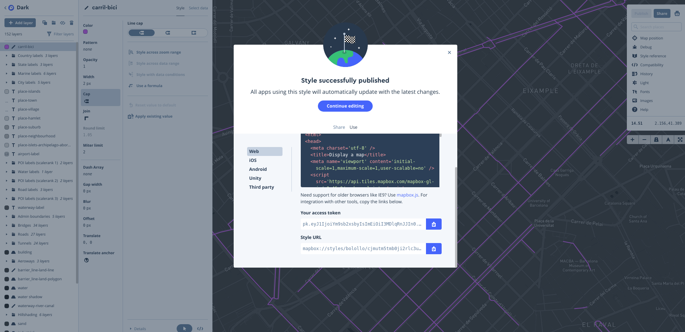
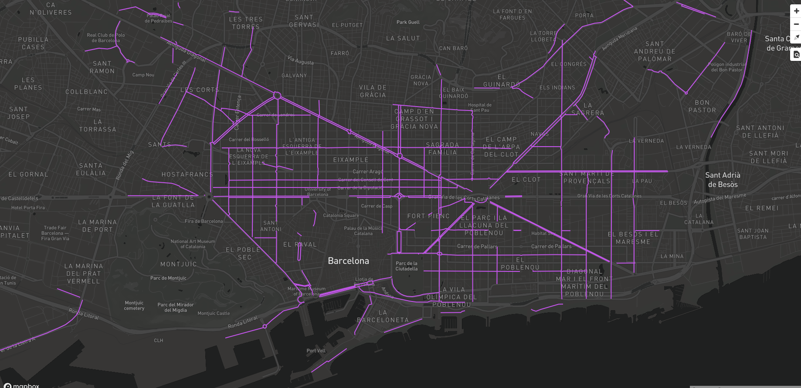
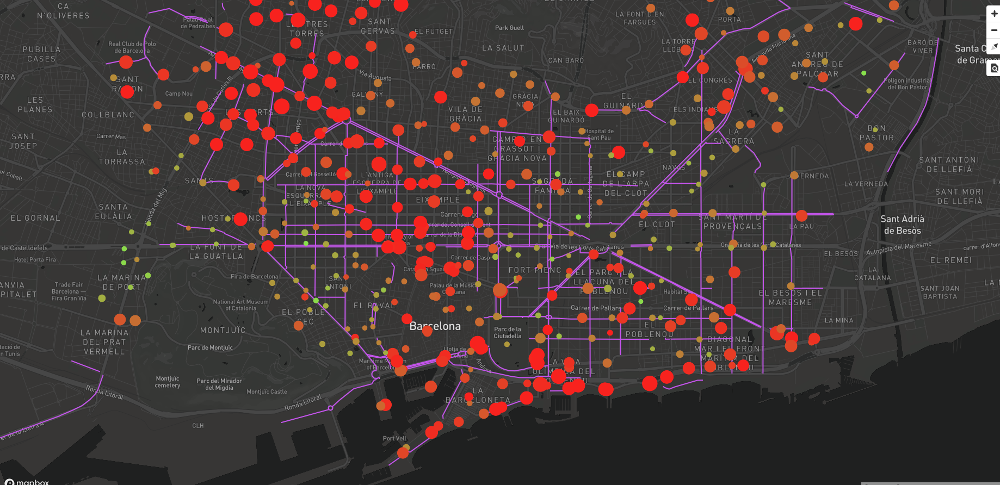
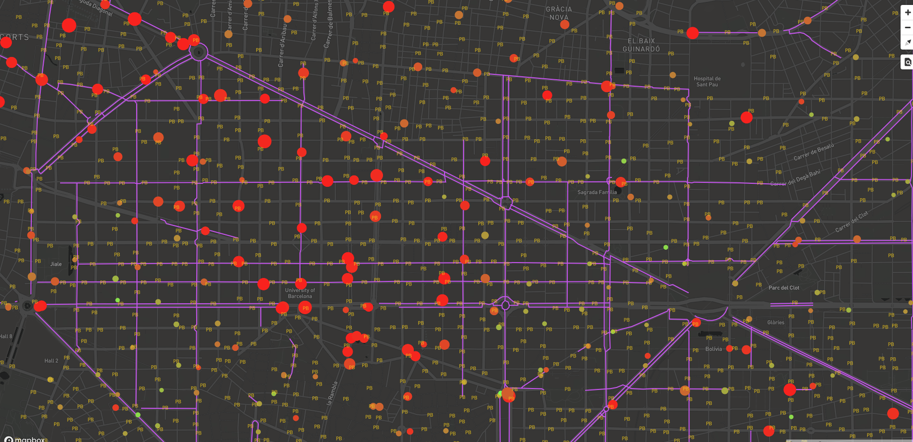

# Cómo simbolizarlas (mapbox studio)

Para dar estilo a las Teselas Vectoriales utilizando la librería de Mapbox GL hay que seguir la especificación de estilo de Mapbox <https://www.mapbox.com/mapbox-gl-js/style-spec>. La definición del estilo se describe en un JSON.

Para facilitar la creación del JSON de estilo, Mapbox ha creado el Mapbox Studio que permite crear un estilo fácilmente de forma visual.

## Crear un estilo simple

Para crear un estilo hay que seleccionar la pestaña **Styles** dentro del Mapbox Studio.

Se puede crear un estilo desde cero o se puede utilizar algún template de los que ofrece Mapbox.

Seleccionar la opción de **More options** *Pick a template or upload a style*. En la ventana que se muestra presionar el botón *Create* del estilo **Dark**


Template estilo dark

### Agregar la capa de datos

El template seleccionado ya tiene una serie de capas que sirven como capas base o capas de referencia. La vista inicial está centrada en Boston así que lo primero que tenemos que hacer es navegar por el mapa y centrar la vista en Barcelona.

Para agregar una capa nueva presionar el botón **+ Add layer**.

En la ventana que se despliega seleccionar la fuente de datos (*Source*) de **carril_bici**.

Para dar estilo a la capa seleccionar la pestaña de *Style*.

Cambiar el color por defecto (negro) por un color que resalte sobre el mapa. Por ejemplo un magenta (#c753ee).

Cambiar la propiedad ancho (*Width*) de la línea a 2px.

Una vez definido el estilo presionar el botón **Publish**. Aparece una ventana que permite comparar la versión previa publicada con la nueva versión de nuestro estilo. Al presionar el botón **Publish** aparece una nueva ventana que contiene 2 pestañas:

* **Share:** indica la url de nuestro estilo.

* **Use:** muestra varias opciones de código para usar en diferentes plataformas. En nuestro caso nos interesa la opción *Web*.

En la opción Web aparte del ejemplo de código para usar en una página web se muestra nuestro **access token** y la URL del estilo.


Datos estilo carril bici

## Visualizar el estilo

Modificar el archivo barcelona.html para que muestre nuestro estilo. El archivo contendrá el siguiente código:

Actualizar el *access token* y la url del estilo

```html hl_lines="20 23"
<!DOCTYPE html>
<html>
<head>
    <meta charset="UTF-8">
    <meta name="viewport" content="width=device-width, initial-scale=1">
    <title>Mapa VT</title>
    <script src='https://api.tiles.mapbox.com/mapbox-gl-js/v0.49.0/mapbox-gl.js'></script>
    <link href='https://api.tiles.mapbox.com/mapbox-gl-js/v0.49.0/mapbox-gl.css' rel='stylesheet' />
    <link href='https://mapbox-gl-inspect.lukasmartinelli.ch/dist/mapbox-gl-inspect.css' rel='stylesheet' />
    <script src='https://mapbox-gl-inspect.lukasmartinelli.ch/dist/mapbox-gl-inspect.min.js'></script>
    <style>
        html, body {
            margin: 0;
            height: 100%;
        }
    </style>
</head>
<body id='map'>
<script>
    mapboxgl.accessToken = 'pk.eyJ1IjoiYm9sb2xsbyIsImEiOiI3MDlqRnJJIn0.m-zCTI_UaEOCiCakGUDwcw';
    var map = new mapboxgl.Map({
        container: 'map', // id del elemento HTML que contendrá el mapa
        style: 'mapbox://styles/bolollo/cjmutm5tmb0ji2rlc3ushd4ug', // Ubicación del estilo
        center: [2.175, 41.39], // Ubicación inicial
        zoom: 13, // Zoom inicial
        bearing: -45, // Ángulo de rotación inicial
        hash: true // Permite ir guardando la posición del mapa en la URL
    });

    // Agrega controles de navegación (zoom, rotación) al mapa:
    map.addControl(new mapboxgl.NavigationControl());
    // Agregar el control de inspección
    map.addControl(new MapboxInspect());

</script>
</body>
</html>
```

Recargar la página del mapa y se deben ver los carriles bici en el mapa.


Estilo carril bici

## Estilo por rango de valores

Cargar la capa de estaciones de bicing (**stations**) en el estilo.

En la propiedad de *Radius* seleccionar la opción **Style across data range**. Se despliega una ventana con los atributos de tipo numérico de la capa. Seleccionar el atributo **slots** (que representa la capacidad de bicicletas de la estación de bicing). Se muestra una ventana con 2 opciones de estilo una para el valor mínimo del campo y otra para el máximo. Si se desea, se pueden agregar más rangos de valores. Seleccionar la opción del valor máximo (slots 33) y cambiar el valor de *Circle radius* por 15px. Presionar el botón de *Done*. Vemos que el tamaño de los circulos que representan las estaciones de bicing varian dependiendo de la capacidad de la estación.

En la propiedad de *Color* seleccionar la opción **Style across data range**. En este caso seleccionar el atributo **bikes** (que representa el número de bicicletas disponibles en la estación). Para la primera opción (que serían las estaciones con 0 bicis disponibles) seleccionar un color rojo (#f91a1a). Para la segunda opción (bikes 37) seleccionar un color verde (#7cfa52). Presionar el botón de *Done*. Vemos que el color de los circulos que representan las estaciones de bicing varia dependiendo de la disponibilidad de bicis de la estación.

Presionamos el botón **Publish** para publicar los cambios. Vemos que la URL del estilo se mantiene, así que no tenemos que modificar nada en nuestra página.

Recargar la página del mapa para ver los carriles bici y las estaciones en el mapa.


Estilo carril bici + estaciones

## Estilo por nivel de zoom

Cargar la capa de puntos de anclaje de bicicletas (**punts_ancoratge_bicicletes**) en el estilo. Cambiar el tipo de capa (*Type*) de Circle a Symbol. Esto nos permitirá simbolizar la capa con un icono o una etiqueta. Cambiar la visibilidad de la capa (*Zoom extent*) a Min = 11 y Max = 22. 

En la propiedad *Text field* en lugar de seleccionar un atributo de la capa escribir **PB**

En la propiedad *Color* seleccionar un amarillo (#f3ca16)

En la propiedad *Size* seleccionar la opción **Style across zoom range**. Se muestra una ventana con 2 opciones de estilo; una para el valor mínimo del zoom del mapa y otra para el máximo. En la primera opción cambiamos el valor de zoom a 11 y el *Text size* a 5px. Para la segunda opción *Zoom 22* cambiar el *Text size* a 22px. Presionar el botón de *Done*. Si hacemos zoom en el mapa vemos que el tamaño de la letra varía según el nivel de zoom. Mientras más nos acercamos más grande es la letra.

Presionamos el botón **Publish** para publicar los cambios. Vemos que la URL del estilo se mantiene, así que no tenemos que modificar nada en nuestra página.

Recargar la página del mapa para ver los carriles bici, las estaciones en el mapa y los puntos de anclaje.


Estilo carril bici + estaciones + anclajes
