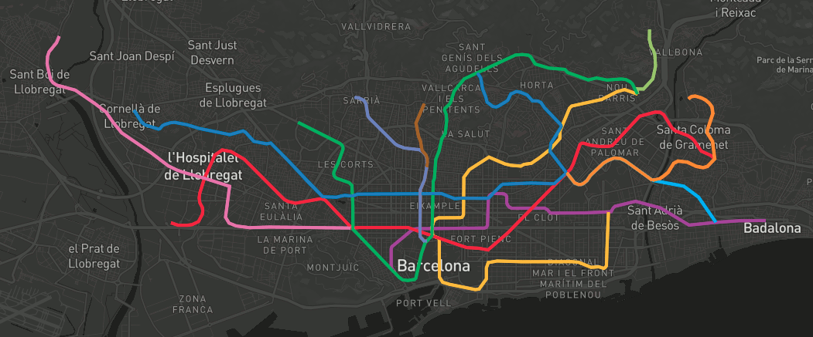
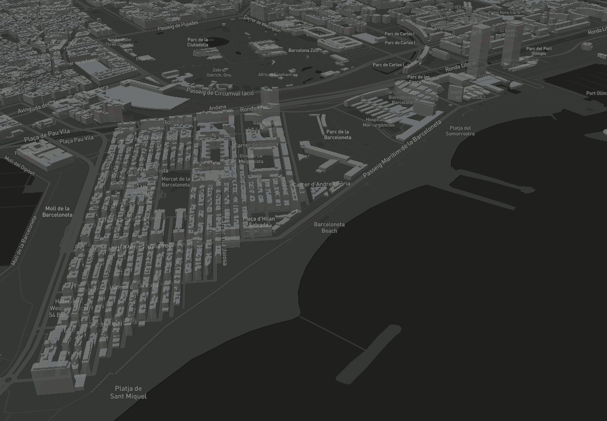

# Cómo consumirlas (mapbox gl js)

## ¿Y sin teselas? Cargar datos directamente en GeoJSON



```html hl_lines="17 18 19 20 22 23 24 25 26 27 28 29 30"
    <script>
        mapboxgl.accessToken = 'pk.eyJ1IjoiYm9sb2xsbyIsImEiOiI3MDlqRnJJIn0.m-zCTI_UaEOCiCakGUDwcw';
        var map = new mapboxgl.Map({
            container: 'map', // id del elemento HTML que contendrá el mapa
            style: 'mapbox://styles/mapbox/dark-v9', // Ubicación del estilo
            center: [2.175, 41.39], // Ubicación inicial
            zoom: 13, // Zoom inicial
            bearing: -45, // Ángulo de rotación inicial
            hash: true // Permite ir guardando la posición del mapa en la URL
        });
        // Agrega controles de navegación (zoom, rotación) al mapa:
        map.addControl(new mapboxgl.NavigationControl());
        // Agregar el control de inspección
        map.addControl(new MapboxInspect());

        map.on('load', function () {
            map.addSource('metro', {
                type: 'geojson',
                data: 'http://mappingandco.github.io/geojsonDB/barcelona/subway.geojson'
            });

            map.addLayer({
                'id': 'metro',
                'source': 'metro',
                'type': 'line',
                'paint': {
                    'line-color': ['get', 'stroke'],
                    'line-width': 4
                }
            });
        });
    </script>
```

!!! note "Demo GeoJSON"
    [Ejemplo interactivo](ejemplos/04-geojson.html)

!!! hint "Documentación"
    * [Tipos de `source` en Mapbox GL](https://www.mapbox.com/mapbox-gl-js/api/#sources)
    * [Tipos de `layer` en Mapbox GL](https://www.mapbox.com/mapbox-gl-js/style-spec#layers)
    * [Expresiones en Mapbox GL](https://www.mapbox.com/mapbox-gl-js/style-spec#expressions)


## Selección y filtrado


```html hl_lines="18 19 20 21 22 23 24 25 26 27 29 30 31 32 33 34 36 37 38 39 40"
    <script>
        map.on('load', function () {
            map.addSource('metro', {
                type: 'geojson',
                data: 'http://mappingandco.github.io/geojsonDB/barcelona/subway.geojson'
            });

            map.addLayer({
                'id': 'metro',
                'type': 'line',
                'source': 'metro',
                'paint': {
                    'line-color': ['get', 'stroke'],
                    'line-width': 4
                }
            });

            map.addLayer({
                'id': 'metro-highlighted',
                'type': 'line',
                'source': 'metro',
                'paint': {
                    'line-color': ['get', 'stroke'],
                    'line-width': 21
                },
                'filter': ['in', 'OGC_FID', '']
            });

            map.on('mousemove', 'metro', function(e) {
                if (e.features.length > 0) {
                    var feature = e.features[0];
                    map.setFilter('metro-highlighted', ['in', 'OGC_FID', feature.properties.OGC_FID]);
                }
            });

            map.on('mouseleave', 'metro', function() {
                map.setFilter('metro-highlighted', ['in', 'OGC_FID', '']);
                overlay.style.display = 'none';
            });
        });
    </script>
```

!!! note "Demo Hover"
    [Ejemplo interactivo](ejemplos/05-hover.html)

!!! hint "Documentación"
    * [Eventos de mapa en Mapbox GL](https://www.mapbox.com/mapbox-gl-js/api#map.event:resize)


## Extrusión 3D



```javascript hl_lines="10 12 13 14"
    map.addSource("buildings", {
        "type": "vector",
        "url": "http://tileserver.fonts.cat/data/buildingpart.json"
    });

    map.addLayer({
        "id": "buildings",
        "source": "buildings",
        "source-layer": "buildingpart",
        "type": "fill-extrusion",
        "paint": {
            "fill-extrusion-opacity": 0.75,
            "fill-extrusion-color": "#808080",
            "fill-extrusion-height": ["*", 3, ["get", "floors"]]
        }
    });
```

!!! note "Demo Edificios 3D"
    [Ejemplo interactivo](ejemplos/06-buildings.html)
