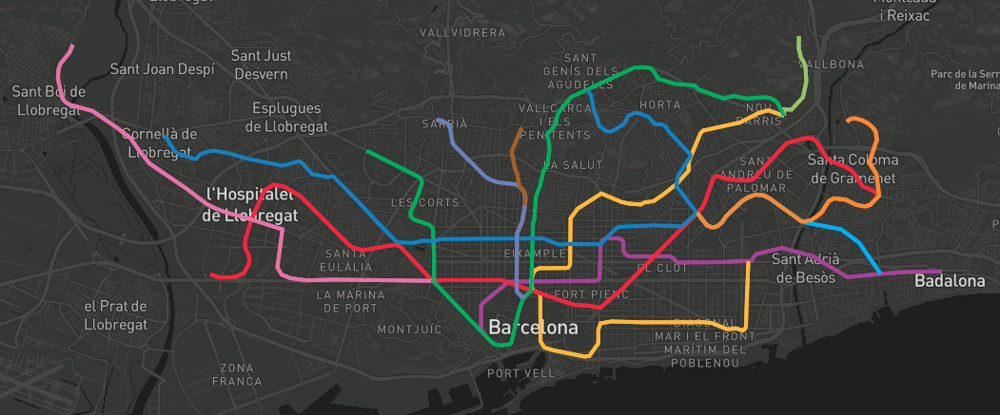

# Documentacion y ejemplos

## Todos los ejemplos

### Hola mapa: [ejemplos/01-hola-mapa.html](ejemplos/01-hola-mapa.html)

### Inspector: [ejemplos/02-inspector.html](ejemplos/02-inspector.html)

### Tileset: [ejemplos/03-tileset.html](ejemplos/03-tileset.html)

### GeoJSON: [ejemplos/04-geojson.html](ejemplos/04-geojson.html)

### Hover: [ejemplos/05-hover.html](ejemplos/05-hover.html)

### Buildings: [ejemplos/06-buildings.html](ejemplos/06-buildings.html)

## Iconos: SVG, PNG y sprites para Mapbox GL

https://github.com/oscarfonts/TMB-Icons

http://fonts.cat/TMB-Icons

## Versión ampliada del taller

Versión completa del taller, de 4 horas, donde se entra mucho más en detalle en cómo crear y servir teselas vectoriales en nuestros propios servidores, sin depender de una cuenta de Mapbox: https://geoinquiets.github.io/taller-vt/

## Documentación oficial

La web de referencia tiene 4 pestañas. Os estaréis moviendo entre las dos primeras, que contienen enlaces hacia los ejemplos de la tercera:

1. API: https://www.mapbox.com/mapbox-gl-js/api/
2. Style Spec: https://www.mapbox.com/mapbox-gl-js/style-spec
3. Examples: https://www.mapbox.com/mapbox-gl-js/example/simple-map/
4. Plugis: https://www.mapbox.com/mapbox-gl-js/plugins

## Galería de ejemplos de aplicaciones de transporte público (no necesariamente usando vector tiles)

WebVMT linked to an embedded YouTube video (Viaje en tren Londres - Brighton)
http://webvmt.org/demos/youtube

Trenes en tiempo real Londres
https://traintimes.org.uk/map/tube/schematic/

Exemple de consulta de tots els serveis de bicicletes compartides arreu del món, inclou Barcelona (va passar per Geoinquiets)
http://bikes.oobrien.com/barcelona/#zoom=13&lon=2.1664&lat=41.4039

Combinar el mapa de les estacions de Bicing amb el plugin Isocrones de Leaflet per si en 30 minuts et dona temps de pedalar d'estació origen a estació destí
https://github.com/traffordDataLab/leaflet.reachability
